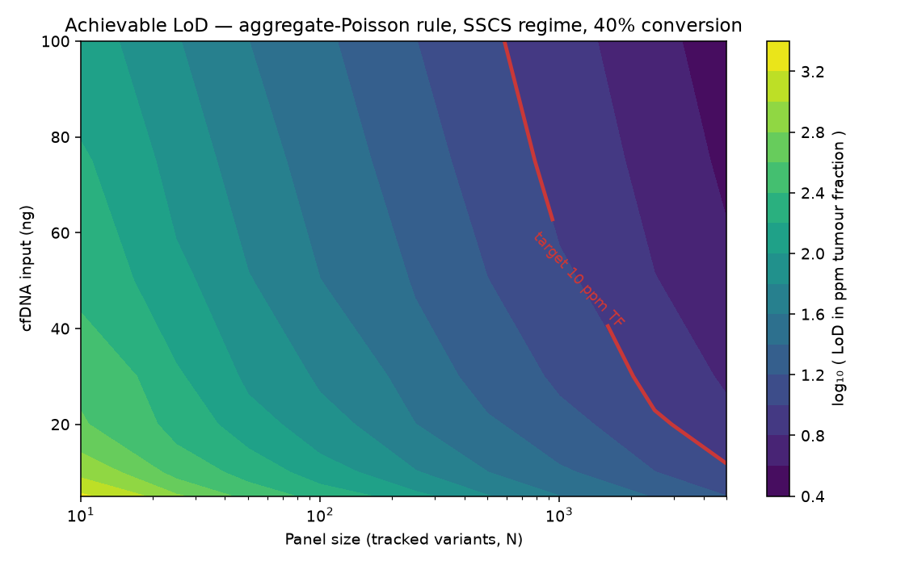

# mrd-lod-sim

**A limit-of-detection simulator and design tool for tumour-informed ctDNA MRD assays.**

**What it does:** tells you the limit of detection a given assay design can reach, and the cheapest
change that would get you to a target. **Who it's for:** anyone sizing an MRD assay — panel size,
cfDNA input, conversion efficiency, consensus chemistry. **Try it now:** open
`outputs/dashboard.html` (generate it with the Quickstart below) and drag the sliders.

## What problem does this solve — and why simulation is *permanently* necessary

This tool answers one question: **given an assay configuration, what limit of detection (LoD)
can it achieve, and what would it take to reach a target?** It maps the feasibility envelope of a
tumour-informed ctDNA minimal-residual-disease assay across panel size, cfDNA input, conversion
efficiency, error regime, and detection rule.

Simulation here is not a stopgap until real data arrives — it is permanently necessary. A real
sample **cannot provide ground truth at ppm**: you never know the true tumour fraction of a patient
specimen to the part-per-million, so you cannot use real samples to unit-test a detection rule,
regression-test after a chemistry change, or re-tune a calling threshold. A specified-truth model is
the *only* way to do those things — you set the truth, run the caller, and check it recovers what you
put in. That is why the detection rule is written to consume real per-site observations and the
validation layer is agnostic to whether its inputs came from simulation or the wet lab: the same code
serves priors today and real data tomorrow.

## Quickstart (uv)

```bash
uv sync                                                    # install
uv run pytest                                              # run the test suite
uv run mrd-lod dashboard --config configs/default.toml --out outputs/dashboard.html
uv run mrd-lod simulate  --config configs/default.toml --out results/
uv run mrd-lod surface   --config configs/default.toml --out results/
```

Open `outputs/dashboard.html` in any browser (it is a single self-contained file; Plotly loads from
CDN — see *Offline use* below). Scenarios are plain TOML in `configs/` — edit
`input_ng`, `conversion_efficiency`, `n_variants`, the error `regime`, the detection `rule`, and the
`target` — no code required. The dashboard also exposes the example scenarios as a one-click preset
dropdown, so you don't have to touch TOML at all.

> **The default scenario opens on the recommended chemistry** — linked duplex (CODEC-type) at a
> 10 ppm TF target — so it loads on a passing (green) configuration. To see the diagnostic path (the
> red *misses target* state and the "what would it take?" lever analysis), switch the error regime to
> **SSCS** or **conventional Duplex**.

## Hero figure



Achievable LoD (ppm tumour fraction) over panel size × cfDNA input for the default scenario. The red
line is the 10 ppm TF target contour: configurations up and to the right of it meet the target.
Regenerate with `uv run python scripts/make_hero_figure.py`.

## The scientific model

Conventions matter more than cleverness. Two are load-bearing:

- The model works internally in **per-site VAF**; users reason in **tumour fraction (TF)**. For a
  clonal heterozygous SNV, **VAF = TF / 2**. Every output states which quantity it is. Confusing them
  is a factor-of-two error at ppm scale.
- Every assay assumption is a **parameter**, never a constant.

### Molecule budget

```
GE_total = input_ng / pg_per_genome_equivalent          # pg_per_GE ≈ 3.3 pg (0.0033 ng)
GE_eff   = GE_total × conversion_efficiency × strand_recovery
```

`conversion_efficiency` (usable consensus families ÷ input molecules, typically 0.2–0.6) is the most
commonly underestimated parameter and a frequent cause of disappointing real-world LoD.
`strand_recovery` is a separate penalty (~0.5 for duplex, where both strands must be recovered) so the
duplex trade-off — lower error, fewer usable molecules — stays explicit.

### Per-site sampling (Monte Carlo)

For each tracked site *i* at per-site `vaf`, panel size `N`:

```
vaf_i        = vaf × ccf_i                    # ccf_i from the panel CCF distribution
depth_i      = GE_eff                         # optionally dispersed
mutant_i     ~ Poisson(depth_i × vaf_i)       # true signal
background_i ~ Poisson(depth_i × eps_i)       # eps_i from the error model
observed_i   = mutant_i + background_i
```

Poisson (not Binomial) because `vaf ≪ 1` — valid below ~1% VAF.

### Analytic fast path

For the aggregate rule the sum of independent Poissons is Poisson:

```
λ_signal  = GE_eff × N × vaf × E[ccf]
λ_bg      = GE_eff × N × E[eps]               # E[eps] = the error model's MEAN, not its median
P(detect) = 1 − PoissonCDF(threshold − 1, λ_signal + λ_bg)
```

The k-of-N rule has an exact form too (per-site Poisson tail → `Binomial(N, p)`); the likelihood-ratio
rule has no closed form and is served, where a fast path is required, by the labelled aggregate-Poisson
proxy. The Monte Carlo and analytic paths agree within Monte Carlo error in the analytic-valid regime —
this is the headline test that validates both implementations.

### Error regimes (order-of-magnitude priors)

Each regime sets two **independent** parameters — the background error rate `eps` and the molecule
retention `strand_recovery`:

| Regime | `eps` | `strand_recovery` | Method |
|---|---|---|---|
| `RAW`            | ~1e-3 | 1.0  | none (raw reads) |
| `SSCS`           | ~1e-5 | 1.0  | single-strand UMI consensus |
| `DUPLEX`         | ~1e-7 | ~0.5 | conventional duplex — strand re-pairing costs molecules |
| `LINKED_DUPLEX`  | ~1e-7 | ~0.8 | linked duplex (CODEC-type) — strands joined before dissociation |

### Both-strand evidence is not the same as conventional duplex

It is tempting to treat "trust a variant only if it appears on both strands" as inherently costing you
half your molecules. It does not. That molecule penalty is an artefact of *conventional* duplex
sequencing, where the two strands of each original molecule dissociate during library preparation and
must be re-paired computationally afterwards — and that re-pairing is what wastes reads and molecules.

Methods that **physically link the two strands before dissociation** (CODEC-type approaches, and
PEG-linker / circularisation variants) obtain the same both-strand error suppression at far higher
retention. So error suppression (`eps`) and molecule retention (`strand_recovery`) are **two
independent axes**: different both-strand chemistries sit at different points in that space, and this
tool models the two axes separately rather than hardcoding one coupling. `strand_recovery` is itself an
order-of-magnitude prior — in conventional duplex it is depth-dependent. Linked-duplex reference:
Yin et al., *Nature Genetics* 2023 (CODEC).

## Assumptions and limitations

Being precise about what the model does **not** capture is a feature, not a caveat:

- **Independence across sites.** Errors and dropout are modelled as independent per site; real assays
  show *correlated* error and dropout. This makes the model optimistic about aggregate rules.
- **No clonal haematopoiesis.** CH variants that mimic tumour signal are not modelled.
- **No fragmentomics or cfDNA biology.** Fragment-size selection, biological cfDNA variation, and
  tumour-shedding heterogeneity are absent; shedding is assumed uniform.
- **Idealised probe capture.** Capture is uniform unless per-site dropout is switched on; real capture
  efficiency varies by probe.
- **Poisson signal.** Valid for `vaf ≪ 1`; not intended above ~1% VAF.
- **The analytic path collapses heterogeneity** (per-site error and CCF) to expectations and assumes
  fixed depth with no dropout. Configurations with depth dispersion or dropout must use the Monte Carlo
  path — the analytic path raises rather than silently approximating.

### Scope boundary

This tool starts from **per-site counts**. It does **not** implement read alignment, UMI collapsing,
variant calling, or BAM/FASTQ handling — those belong to the upstream pipeline that produces the
`(mutant_count, total_count, error_rate)` observations the detection rule consumes.

## The three-phase roadmap

The same code serves three phases as real data becomes available:

| Phase | Data available | What changes | Modules |
|---|---|---|---|
| **Now** | none | run on literature priors to map the design space | `params`, `molecules`, `errors` (presets), `analytic`, `simulate`, `surface`, `report` |
| **Soon** | healthy-donor sequencing | replace the assumed error model with an empirical one | `calibrate.estimate_error_model` → `EmpiricalError`; `calibrate.fit_conversion_efficiency` |
| **Later** | dilution-series results | fit LoD from real data; diagnose predicted-vs-observed gaps | `validate` (LoB/LoD/LoQ/threshold/power), `calibrate.compare_predicted_observed` |

The detection rule (`detect.py`) and the validation layer (`validate.py`) are **data-source agnostic**:
they consume the same inputs from simulation today and from the wet lab later, with no code change.
`validate.py` never imports `simulate.py` (enforced by a test).

## Offline use

The dashboard loads Plotly from CDN so it works as an email attachment on a machine with network
access. To make it fully offline, download `plotly.min.js` and replace the
`<script src="https://cdn.plot.ly/…">` tag in the generated HTML with an inline `<script>…</script>`
containing its contents.

## Citations for the literature-derived priors

All numeric priors are **order-of-magnitude**, cited as priors and **not** presented as measurements:

- Genome mass ≈ 3.3 pg per haploid genome equivalent — standard human genome mass (e.g. Doležel et al.,
  *Cytometry* 2003).
- `RAW` ~1e-3 per-base substitution error — raw Illumina error rate (e.g. Schirmer et al., *BMC
  Bioinformatics* 2016).
- `SSCS` ~1e-5 — single-strand UMI consensus (Kennedy et al., *Nature Protocols* 2014).
- `DUPLEX` ~1e-7 — conventional duplex sequencing (Schmitt et al., *PNAS* 2012).
- `LINKED_DUPLEX` ~1e-7 at higher retention — concatenating original duplex sequencing / CODEC
  (Yin et al., *Nature Genetics* 2023).

Replace these with values fitted from your own data via `mrd-lod calibrate` as soon as it exists.

## Development

```bash
uv run pytest                      # full suite (scientific-correctness first)
uv run python scripts/make_hero_figure.py
```

The build order and every design decision are documented in
[`docs/mrd-lod-sim_BUILD_SPEC.md`](docs/mrd-lod-sim_BUILD_SPEC.md).
